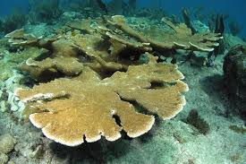

# Эпигенетика и вторичные структуры ДНК у *Acropora palmata*

Курсовой проект, НИУ ВШЭ, майнор «Биоинформатика», 2026.
Полонский Святослав. Команда «Acropora».

## Описание организма



*Acropora palmata* — карибский лосерогий коралл (англ. *elkhorn coral*). Назван так из-за плоских лопастных ветвей, похожих на лосиные рога. Раньше формировал гребни карибских рифов, где живёт большинство рыб. Численность упала >80% с 1980-х из-за обесцвечивания и болезней. IUCN — Critically Endangered. Гибридизуется с *A. cervicornis* (карибский олений коралл).

| | |
|---|---|
| Сборка генома | NCBI RefSeq GCF_964030605.1 |
| Уровень сборки | Хромосомный (244 скаффолда, самый длинный 31.8 Мб) |
| Размер генома | 334 Мб |
| N50 | 22.6 Мб |
| Сколько генов аннотировано | 39 263 |
| Сколько белков | 21 010 |
| GC-содержание | 39 % |
| Статей про вид на PubMed | 143 |

## Результаты инд.части

### 1. Гены отвечающие за эпигенетику

Для нахождения генов, отвечающих за эпигенетику мы выбрали один набор из 16 семейств, чтобы потом было удобнее. Все 16 нашлись, вот нужная таблица соответствий. Сама таблица [`results/epigenetic_genes.csv`](results/epigenetic_genes.csv) достаточно большая, поэтому я взял по гену для каждого семейства.

| Семейство (Pfam) | Название гена | Хромосома | Старт | Стоп | Стренд |
|---|---|---|---|---|---:|
| PF00125 (Histone) | LOC141866834 | NC_133895.1 | 2610647 | 2611178 | - |
| PF00145 (DNMT) | LOC141882846 | NC_133882.1 | 26316122 | 26342292 | - |
| PF00385 (Chromo) | LOC141876265 | NC_133884.1 | 8438149 | 8482394 | + |
| PF00439 (Bromodomain) | LOC141863352 | NC_133894.1 | 13112842 | 13166697 | - |
| PF00538 (Linker_histone) | LOC141865918 | NC_133895.1 | 2608105 | 2609385 | - |
| PF00567 (Tudor) | LOC141895373 | NC_133891.1 | 18552729 | 18580491 | + |
| PF00628 (PHD) | LOC141881716 | NC_133886.1 | 23213328 | 23262186 | - |
| PF00850 (HDAC) | LOC141879107 | NC_133885.1 | 9500940 | 9511754 | - |
| PF00856 (SET) | LOC141874844 | NC_133883.1 | 21853792 | 21868252 | - |
| PF01429 (MBD) | LOC141880591 | NC_133886.1 | 2238107 | 2266093 | - |
| PF01853 (MOZ_SAS) | LOC141894073 | NC_133891.1 | 17255478 | 17265822 | + |
| PF02008 (zf-CXXC) | LOC141863071 | NC_133894.1 | 14994735 | 15008474 | - |
| PF02146 (SIR2) | LOC141890550 | NC_133889.1 | 21858168 | 21867410 | + |
| PF02373 (JmjC) | LOC141866549 | NC_133895.1 | 17371083 | 17381073 | + |
| PF02463 (SMC_N) | LOC141892134 | NC_133890.1 | 15074741 | 15102644 | - |
| PF08512 (Rad21) | LOC141895645 | NC_133891.1 | 2745403 | 2758425 | - |

**Вывод.** У *A. palmata* есть много генов, отвечающих за эпигенетику, причем некоторые семейства присутвствуют с большим числом повторений. Нашелся когезин(для групповой части)

### 2. G-квадруплексы и Z-ДНК

Мы использовали 3 метода(regex для квадруплексов, а также zhunt и zdnabert для Z-ДНК), результаты в файлах: [`results/g4.bed`](results/g4.bed), [`results/zhunt.bed`](results/zhunt.bed), [`results/zdnabert.bed`](results/zdnabert.bed)

### 3. Куда эти структуры попадают

| Участок | Число квадруплексов | Доля квадруплексов (%) | Число предсказаний Zhun | Доля предсказаний Zhun (%) | Число предсказаний ZDNABERT | Доля предсказаний ZDNABERT (%) |
|---|---:|---:|---:|---:|---:|---:|
| **Exons** | 1 401 | 10.1 | 33 901 | 18.7 | 6 678 | 18.0 |
| **Introns** | 7 730 | 55.9 | 75 285 | 41.5 | 14 322 | 38.6 |
| **Promoters** (1000 up from TSS) | 962 | 7.0 | 18 924 | 10.4 | 6 302 | 17.0 |
| **Downstream** (200 bp) | 228 | 1.7 | 1 857 | 1.0 | 437 | 1.2 |
| **Intergenic** | 3 502 | 25.3 | 51 493 | 28.4 | 9 388 | 25.3 |

Таблица 2:

| Участок | Всего | Число участков с  квадруплексом | Доля участков с предсказанным квадруплексом  (%) | Число участков предсказаний Zhun | Доля участков предсказаний Zhun  (%) | Число участков предсказаний Z-DNABERT | Доля участков предсказаний Z-DNABERT  (%) |
|---|---:|---:|---:|---:|---:|---:|---:|
| **Exons** | 202 821 | 1 311 | 0.7 | 23 092 | 11.4 | 5 751 | 2.8 |
| **Introns** | 168 040 | 6 928 | 4.1 | 42 819 | 25.5 | 11 303 | 6.7 |
| **Promoters** | 25 086 | 1 336 | 5.3 | 12 780 | 50.9 | 4 840 | 19.3 |
| **Downstream** | 35 520 | 336 | 1.0 | 7 328 | 20.6 | 2 754 | 7.8 |
| **Intergenic** | 14 878 | 2 308 | 15.5 | 8 684 | 58.4 | 4 595 | 30.9 |

### 4. Сравнение с фоном

Для оценки значимости наблюдаемых статистик проводим оценку для фона, используя bedtools shuffle. Смотрим, какая доля структур попадает в участки при случайном распределении.

| Участок | Тип | Число квадруплексов | Доля квадруплексов (%) | Число предсказаний Zhunt | Доля предсказаний Zhunt (%) | Число предсказаний ZDNABERT | Доля предсказаний ZDNABERT (%) |
| :--- | :--- | ---: | ---: | ---: | ---: | ---: | ---: |
| **Exons** | Наблюдаемая | 1401 | 10.1 | 33901 | 18.7 | 6678 | 18.0 |
| | Ожидаемая (фон) | — | 23.6 | — | 22.8 | — | 23.2 |
| **Introns** | Наблюдаемая | 7730 | 55.9 | 75285 | 41.5 | 14322 | 38.6 |
| | Ожидаемая (фон) | — | 44.1 | — | 44.7 | — | 44.3 |
| **Promoters (1000 up from TSS)** | Наблюдаемая | 962 | 7.0 | 18924 | 10.4 | 6302 | 17.0 |
| | Ожидаемая (фон) | — | 5.3 | — | 5.4 | — | 5.4 |
| **Downstream (200 bp)** | Наблюдаемая | 228 | 1.7 | 1857 | 1.0 | 437 | 1.2 |
| | Ожидаемая (фон) | — | 0.9 | — | 0.9 | — | 0.9 |
| **Intergenic** | Наблюдаемая | 3502 | 25.3 | 51493 | 28.4 | 9388 | 25.3 |
| | Ожидаемая (фон) | — | 26.1 | — | 26.2 | — | 26.2 |

Квадруплексы сконцентрированны в интронах, промотерах и Downstream, а Z-ДНК обогазены в промотерах(где их почти в 2 раза больше, чем в среднем)

## Где что лежит

```
data/
├── README.md               # как скачать геном (NCBI accession)
├── annotation.gff.gz       # GFF от NCBI (распаковать перед запуском)
├── proteome.faa.gz         # белки от NCBI
├── chrom.sizes             # длины контигов
└── pfam/                   # локальная HMM-база (16 семейств)

notebooks/
└── zdnabert_kaggle.py      # скрипт Kaggle-ядра (Z-DNABERT на GPU)

results/
├── epigenetic_genes.csv    # 580 ген-семейство соответствий (HMMER)
├── hmmscan.domtbl          # сырая выдача HMMER
├── g4.bed                  # 13 823 G-квадруплекса
├── zhunt.bed               # 181 460 Z-ДНК (термодинамика)
├── zdnabert.bed            # 37 127 Z-ДНК (нейросеть)
├── zdnabert_kaggle.log     # лог запуска на Kaggle
├── distribution_table1.csv # таблица 1
├── distribution_table2.csv # таблица 2
├── background.csv          # сравнение с фоном (50 шафлов)
├── features/               # экзоны/интроны/промоторы/downstream/intergenic
└── intermediate/           # промежуточные .bed-выдачи bedtools (.tar.gz)

src/                        # все pipeline-скрипты
```
